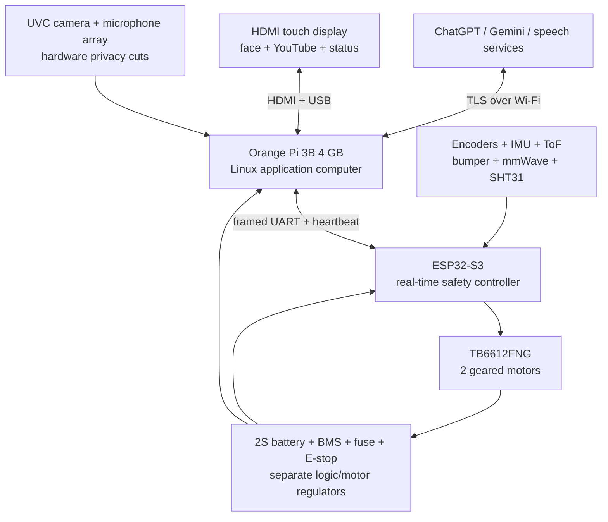

# ARIA V1 — Hardware Architecture and Platform Selection

**Document ID:** ARIA-ARCH-001  
**Revision:** Draft A  
**Date:** 2026-07-25  
**Status:** Sprint 1 working decision; validate before procurement  
**Source of requirements:** ARIA-PRD-001 v1.0 (Frozen Requirements)

---

## 1. Decision summary

Use a two-computer architecture:

1. **Orange Pi 3B, 4 GB** as the provisional main computer for Linux, display,
   camera, wake word, Vietnamese speech, cloud AI, memory/persona and YouTube.
2. **ESP32-S3** as the independent real-time and safety controller for motors,
   encoders, IMU, range/cliff sensors, bumpers, battery monitoring, heartbeat
   watchdog and emergency stop.

This is a **conditional selection**, not permission to buy the full BOM. The
Orange Pi 3B must first pass the five tests in section 9. If it fails two or more
tests, use Orange Pi 5 4 GB as the fallback and formally revise the budget.

The target BOM is approximately **6,225,000₫ before contingency**. A responsible
purchase plan also keeps roughly 10% contingency, making the realistic funding
need about **6.85 million₫**. Reaching exactly 6 million₫ is possible only after
supplier quotes, reuse of some parts, or accepting a smaller display/basic
microphone prototype. Quality of far-field voice localization must not be
silently traded away.

## 2. Assumptions

- ChatGPT and Gemini inference is performed through cloud APIs; the robot does
  not run a large language model locally.
- Safety, manual stop and basic motion remain local when Internet is unavailable.
- V1 finds a caller in the **same room** only; precise multi-room SLAM and docking
  remain outside V1.
- The first prototype is a bench/low-speed indoor robot, not a finished consumer
  product.
- Component prices are estimates in VND on 2026-07-25, excluding shipping and
  API subscriptions. They require two local quotes before purchase.
- The 15 × 15 × 15 cm size is a goal, not a constraint. A 7-inch display and safe
  battery enclosure will probably require a larger/taller body.

## 3. Requirements that drive hardware

| Requirement | Hardware consequence |
|---|---|
| ChatGPT + Gemini + Vietnamese conversation | Linux SBC with 4 GB RAM, Wi-Fi and reliable USB audio |
| YouTube + animated face | Hardware video decode and HDMI touch display |
| Person detection/tracking | Wide-angle UVC camera and lightweight model |
| Find caller | Microphone array/DOA experiment, camera confirmation and presence sensor |
| Safe differential drive | Encoder motors, IMU, range sensors, bumpers and independent MCU |
| Do not fall down stairs | Down-facing range sensors plus bumper; fail-safe stop |
| Privacy | Physical camera/microphone power cuts and truthful LEDs |
| Offline safety | ESP32-S3 owns all motor PWM and stop decisions |

## 4. Options considered

Scores use 1 (poor) to 5 (strong). “Cost” scores affordability, not raw price.

| Main computer | Cost 25% | Compute/CV 25% | Software 20% | Integration 20% | Power 10% | Weighted |
|---|---:|---:|---:|---:|---:|---:|
| Orange Pi 3B 4 GB | 5 | 3 | 3 | 4 | 4 | **3.85** |
| Orange Pi 5 4 GB | 3 | 5 | 3 | 4 | 3 | **3.75** |
| Raspberry Pi 5 4 GB | 2 | 4 | 5 | 5 | 3 | **3.80** |
| Used Android tablet/phone | 4 | 3 | 4 | 2 | 5 | **3.45** |

### Why Orange Pi 3B is first

- RK3566 provides four Cortex-A55 cores, hardware video decode and a small NPU;
  4 GB is enough for a kiosk UI, cloud clients and one lightweight person model.
- Wi-Fi 5 and Bluetooth 5 are on-board, avoiding an extra radio module.
- It preserves more of the 6 million₫ target for safety sensors, power and audio.

### Why it is conditional

- Its software ecosystem and accelerator tooling are less mature than Raspberry
  Pi.
- NPU support is vendor-specific. V1 must work with a CPU fallback.
- Browser video acceleration, USB audio and Bluetooth behavior depend on the OS
  image and must be tested on the exact board revision.

### Fallback

Orange Pi 5 4 GB has much more CPU/NPU headroom and is the preferred technical
fallback, but normally adds about 0.8–1.2 million₫ plus possible Wi-Fi/Bluetooth
cost. Raspberry Pi 5 is easiest to support but is unlikely to fit the target
budget once display, audio, battery and safety hardware are included.

## 5. System architecture

## 6. Hard safety boundaries

- The main computer sends only bounded commands such as target linear/angular
  velocity. It never writes motor PWM.
- ESP32-S3 clamps speed/acceleration and owns closed-loop wheel control.
- Heartbeat target: 10 Hz. If no valid heartbeat is received for **300 ms**, the
  ESP32 commands brake/stop and requires a fresh enable sequence.
- Any bumper hit, invalid cliff reading, detected drop, sensor timeout, brownout
  or emergency-stop event overrides the main computer.
- Motor enable defaults low during boot and reset.
- Use a physical emergency-stop/safety switch in the motor-power path.
- Choose encoder motors whose measured stall current is below the motor driver's
  safe design current. Do not rely only on a seller's “rated current”.
- Camera and microphone switches must cut device power, not merely request a
  software mute. Their indicator LEDs are powered from the switched side so an
  illuminated sensor cannot be hidden by software.

## 7. Caller-finding behavior

1. Local wake-word detector identifies “ARIA”.
2. Microphone subsystem estimates a coarse sound sector.
3. ESP32 rotates at low speed toward the sector while enforcing range/cliff rules.
4. Camera searches for a person; mmWave confirms presence in low light.
5. Robot approaches only while a person track is fresh and front range is valid.
6. It stops at an estimated 0.8–1.2 m.
7. Loss of track, stale range data or ambiguous direction causes a stop, not blind
   forward motion.

The low-cost four-I2S-microphone array in BOM Rev A is an engineering experiment,
not a proven far-field product. If it cannot reach the acceptance tests, replace
it with a USB microphone array providing VAD, AEC, beamforming and direction of
arrival; expect the BOM to rise by roughly 1.0–1.5 million₫.

## 8. Important trade-offs and risks

| Risk/trade-off | Consequence | Mitigation / decision gate |
|---|---|---|
| Low-cost mic array may have poor echo cancellation | Robot hears its own speaker or points incorrectly | Test with speaker active; upgrade to processed USB array if pass rate is low |
| Orange Pi software variability | YouTube, NPU or Bluetooth may be unreliable | Freeze exact board revision and OS image only after bench tests |
| 4 GB has limited headroom | Simultaneous browser, CV and speech may stutter | Measure memory/temperature; reduce video/CV rate or move to Orange Pi 5 |
| ToF sensors can fail on dark/reflective targets | Collision or cliff false reading | Multi-sensor voting, bumpers, timeout-to-stop and physical test course |
| TB6612 may be undersized for chosen motors | Overheat/reset/loss of braking | Measure stall current before approval; use higher-current driver if needed |
| Shared battery creates noise/brownouts | SBC reboots when motors start | Separate regulators, bulk capacitance, grounding test and brownout log |
| 7-inch display drives body size | Miss 15 cm size target, higher center of gravity | Let M3 mechanical layout decide final envelope; keep battery low |
| Cloud APIs need Internet and recurring fees | AI conversation unavailable offline | Local wake word, stop, manual drive and safety remain operational |
| Physical privacy switch integration | Extra wiring and USB power design | Prototype power-cut circuit before enclosure design |

## 9. M1 validation gates

Do not freeze M1 or purchase the full BOM until all gates pass:

1. **Platform smoke test:** Orange Pi boots from microSD 20 consecutive times,
   Wi-Fi reconnects, Bluetooth pairs and a 60-minute 1080p YouTube session has no
   crash or thermal throttling.
2. **Compute test:** one lightweight person detector runs with the UI and audio
   capture simultaneously. Initial target: at least 8 FPS at 640 × 480 and less
   than 85% sustained RAM use.
3. **Audio test:** wake word reaches at least 18/20 successes at 3 m in a quiet
   room and 16/20 with typical fan/speaker noise; coarse direction is within the
   correct 90° sector at least 16/20 times.
4. **Safety-link test:** unplug/reboot the SBC while wheels turn on a raised test
   stand; motors stop within 300 ms. Every cliff sensor and bumper fault also
   stops motion.
5. **Power test:** repeated motor starts, Wi-Fi load, screen at full brightness
   and speaker playback cause no SBC brownout; regulators remain within rated
   temperature.

If gate 2 fails but the rest pass, evaluate Orange Pi 5. If gate 3 fails, retain
the main platform and upgrade only the microphone subsystem.

## 10. Definition of done for Sprint 1

- Exact main-board revision and OS image are recorded.
- Five M1 gates have evidence (photos, logs or measurements).
- Two supplier quotes exist for every critical/high-cost line.
- Measured motor stall current and a 30-minute power budget are recorded.
- BOM total, 10% reserve and exclusions are accepted explicitly.
- Open decisions are resolved or assigned to a later milestone.

## 11. References

- [Orange Pi 3B official product page](https://www.orangepi.org/html/hardWare/computerAndMicrocontrollers/details/Orange-Pi-3B.html)
- [Orange Pi 3B user manual](https://orangepi.net/wp-content/uploads/2023/10/OrangePi_3B_RK3566_user-manual_v1.4.pdf)
- [Orange Pi 5 official product page](https://www.orangepi.org/html/hardWare/computerAndMicrocontrollers/details/Orange-Pi-5.html)
- [ESP32-S3 official product page](https://www.espressif.com/en/products/socs/esp32-s3)
- [VL53L0X official product page](https://www.st.com/en/imaging-and-photonics-solutions/vl53l0x.html)
- [TB6612FNG official product page](https://toshiba.semicon-storage.com/ap-en/semiconductor/product/motor-driver-ics/brushed-dc-motor-driver-ics/detail.TB6612FNG.html)
- [ReSpeaker USB 4 Mic Array reference implementation](https://github.com/respeaker/usb_4_mic_array)

