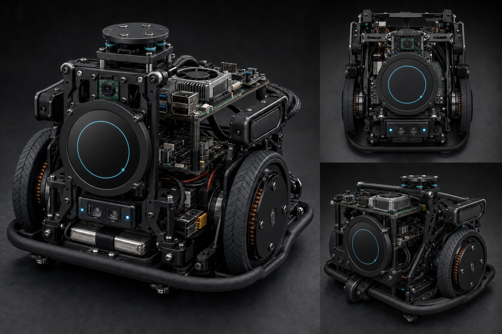

# ARIA-COMPONENT-SHAPE-001 — Component Shape and Chassis Visual Reference

| Field | Value |
|---|---|
| Document ID | ARIA-COMPONENT-SHAPE-001 |
| Revision | A |
| Date | 2026-07-29 |
| Status | Active visual reference; not a manufacturing release |
| Authority | Component identity and quantity come only from ARIA-BOM-001 |

## 1. Purpose

This document records the physical form that must be recognized when collecting product photos, CAD models, and supplier listings. It does not replace dimensional verification, official drawings, or measured samples.

- `Exact product` follows the frozen commercial model.
- `Carrier dependent` remains provisional until an exact breakout/module is selected.
- The chassis image is a packaging concept only. It does not approve dimensions, materials, wheel loading, or fabrication.

## 2. Bare-chassis concept

The concept intentionally has no enclosure. It establishes an exposed two-deck serviceable skeleton, a round 4-inch display on a rigid front bridge, battery and traction hardware on the lowest deck, compute/control electronics above, mechanically isolated microphones and speakers, front/cliff sensors, a rear support wheel, and a low impact rail.

## 3. Frozen component forms

| ARIA ID | Form state | Physical recognition | Visual source |
|---|---|---|---|
| ARIA-CPU-001 | Exact product | Rectangular 85 × 56 mm Raspberry Pi 5 PCB with stacked USB/Ethernet connectors, USB-C power, GPIO header, and four mounting holes. | [Raspberry Pi 5](https://www.raspberrypi.com/products/raspberry-pi-5/) |
| ARIA-MCU-001 | Exact target variant | Narrow rectangular ESP32-S3-DevKitC-1 board with two long pin-header rows, USB connector at one end, and RF-module/antenna region at the other. | [ESP32-S3-DevKitC-1](https://docs.espressif.com/projects/esp-dev-kits/en/latest/esp32s3/esp32-s3-devkitc-1/) |
| ARIA-THM-001 | Exact product | Low-profile Pi 5 active cooler with central blower, aluminum heatsink, spring fasteners, and short fan lead. | [Raspberry Pi Active Cooler](https://www.raspberrypi.com/products/active-cooler/) |
| ARIA-CAM-001 | Exact product | Small rectangular camera PCB with a central wide-angle lens barrel and two mounting holes. | [Camera Module 3](https://www.raspberrypi.com/products/camera-module-3/) |
| ARIA-DSP-001 | Exact product | Waveshare SKU 24603 circular 4-inch DSI display. Outer diameter 126.00 mm; active area diameter 101.52 mm; overall thickness 17.00 mm; front glass 6.00 mm; four M4 mounting points on an 85.00 × 65.00 mm pattern; 5 V supply. | [Product](https://www.waveshare.com/product/4inch-dsi-lcd-c.htm) · [Dimension drawing](../assets/reference/ARIA-DSP-001-dimensions.png) |
| ARIA-AUD-001 | Exact product | Circular four-microphone array PCB with microphones around the perimeter and a central processing/interface region. | [reSpeaker XVF3800](https://www.seeedstudio.com/ReSpeaker-XVF3800-USB-4-Mic-Array-p-6488.html) |
| ARIA-AUD-002 | Exact salvaged set | Thin asymmetric left/right laptop-speaker enclosures with molded acoustic ducts, short harnesses, and mounting tabs. | Approved seller photo pending |
| ARIA-AUD-003 | Carrier dependent | Small rectangular MAX98357A breakout with one header edge and a two-terminal speaker output. | Exact module pending |
| ARIA-MOT-001 | Exact product | Compact 2208 pancake-style three-phase BLDC motor with circular rotor and integrated rear AS5600 encoder assembly. | [DFRobot FIT1035](https://www.dfrobot.com/product-3007.html) |
| ARIA-MOT-002 | Exact product | Tiny rectangular SimpleFOCmini DRI0058 PCB with three motor-phase outputs, power/control headers, and a dominant driver IC. | [DFRobot DRI0058](https://wiki.dfrobot.com/SimpleFOCMini_SKU_DRI0058) |
| ARIA-WHL-001 | Frozen envelope | Two custom circular wheels, Ø60 mm and 18–20 mm wide, with rubber tread and a custom hub/transmission interface. | Custom design item |
| ARIA-SEN-001 | Carrier dependent | Six identical tiny rectangular VL53L1X carrier boards with the black ToF optical package unobstructed and XSHUT exposed. | Exact carrier pending |
| ARIA-SEN-002 | Carrier dependent | Small rectangular BNO085 breakout with the IMU near the board center. | Exact breakout pending |
| ARIA-SEN-003 | Carrier dependent | Very small SHT45 breakout with exposed vented sensor package. | Exact breakout pending |
| ARIA-PWR-001 | Frozen envelope class | Flat rectangular 3S LiPo pouch pack with main discharge lead and separate balance lead; no cylindrical cells. | Exact pack pending |
| ARIA-PWR-002 | Exact product target | Rectangular Enerkey BMS PCB with high-current pads, balance connections, and NTC connection. | Authentic drawing/photo pending |
| ARIA-PWR-003 | Exact product | Compact rectangular Pololu regulator PCB with dominant shielded inductor, power pads, and mounting holes. | [Pololu D24V90F5](https://www.pololu.com/product/2866) |
| ARIA-PWR-005 | Carrier dependent | INA226 IC or small monitor board with external high-side shunt and Kelvin connections. | Exact implementation pending |
| ARIA-PWR-006 | Frozen family | Small rectangular surface-mount Littelfuse Nano² 456 fuse body. | Exact MPN pending |
| ARIA-PWR-007 | Frozen family | SMB-packaged surface-mount TVS diode with metal terminations at both ends. | Exact manufacturer pending |
| ARIA-PWR-008 | Frozen candidate | Flat high-current power MOSFET package used on the mainboard; not a TO-220 module. | Exact suffix/package pending |
| ARIA-UI-001 | Frozen envelope | Cylindrical 12 mm panel-mount metal momentary button with circular LED ring and threaded rear body. | Exact SKU pending |

## 4. Visual-control rule

Before accepting any marketplace image:

1. match the exact ARIA ID and model;
2. compare connector placement, hole pattern, board outline, and component side;
3. reject photos of another revision or generic substitute;
4. save the selected listing image and date with the procurement record;
5. never infer manufacturing dimensions from a concept render.